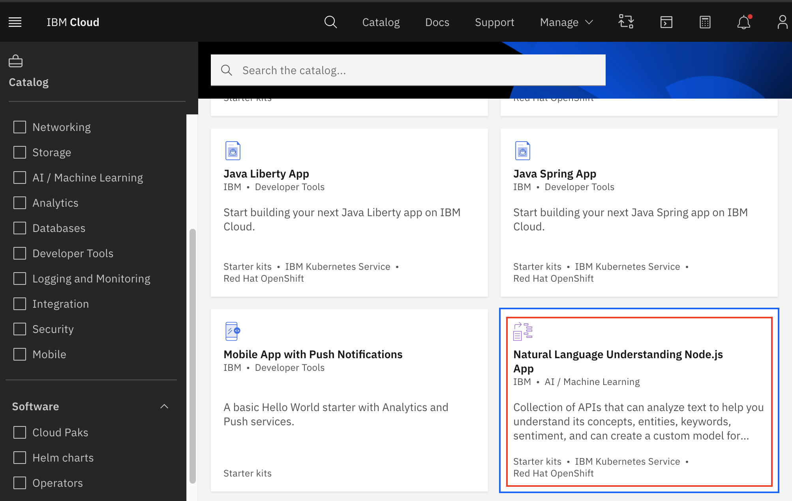
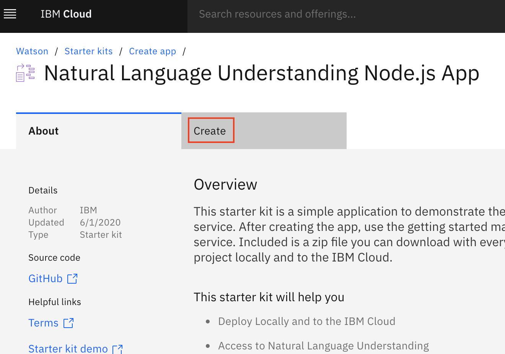
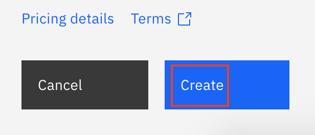
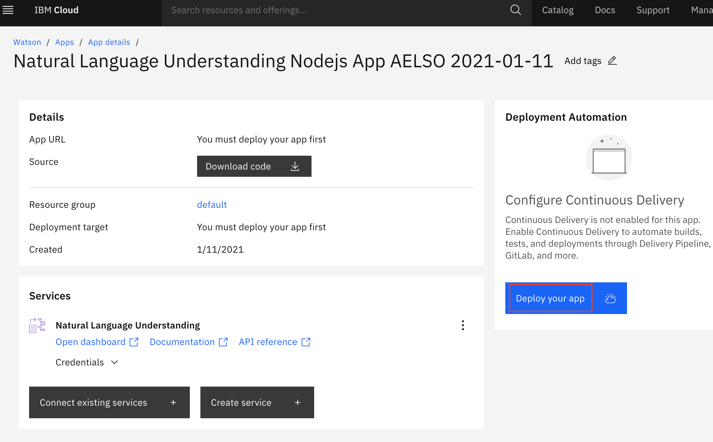
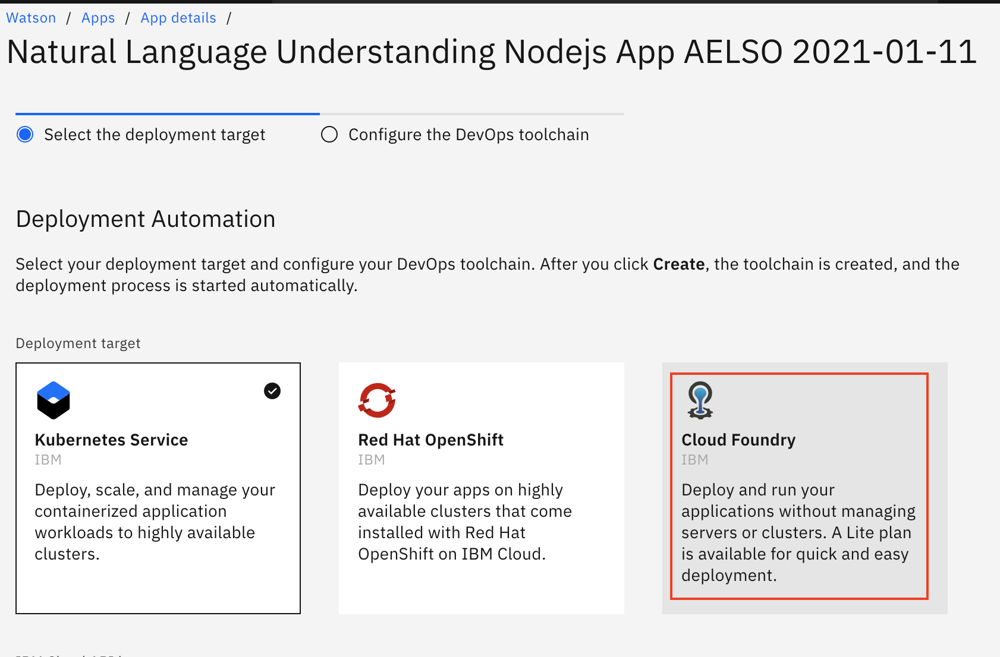
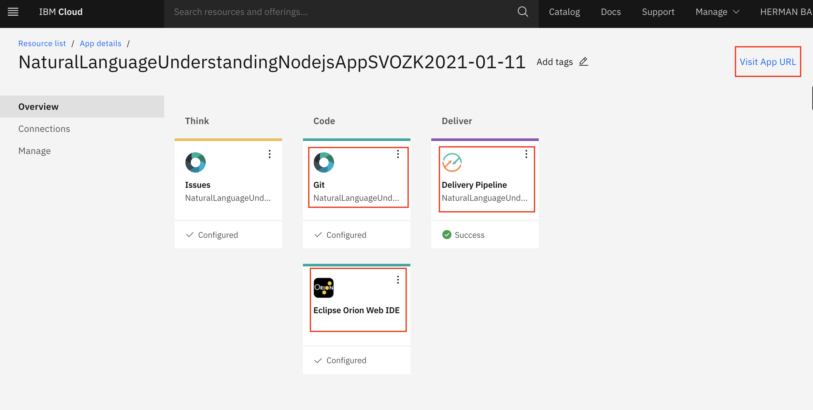

Instructions for Hack the North 2021 IBM API workskshop.

## Table of Contents
- [Resources](#resources)
- [Set up](#set-up)
- [Using your toolchain](#using-your-toolchain)
- [Registering and using the catalog](#registering-and-using-the-catalog)

## Resources
* Connect with the IBM team in the `#ibm` discord channel.
* [IBM Cloud catalog](https://cloud.ibm.com/catalog) - a full list of services you can use in your hack.
* Check out [Call for Code](https://developer.ibm.com/callforcode/).

## Set up
In this workshop, we will make use of a starter kit to demonstrate deploying and using the Natrual Language Understanding service running on the IBM Cloud.
1. Navigate to the [Natural Language Understanding Node.js App](https://cloud.ibm.com/developer/watson/create-app?defaultDeploymentToolchain=&defaultLanguage=NODE&env_id=ibm%3Ayp%3Aus-south&navMode=starterkits&starterKit=b62c00f1-65b2-38a4-9f91-d429fb6745a6) starter kit, or select the entry from the [IBM Cloud catalog](https://cloud.ibm.com/catalog?search=label%3Aboilerplate#software).

1. Click the `Create` tab. If you're not logged in, login or register.

1. Leave the defaults and click the `Create` button.

1. Click `Deploy your app` once the service credentials are created for your Watson AI service.

1. Create a [Cloud Foundry organization](https://cloud.ibm.com/account/cloud-foundry), if you don't already have one. We recommend using `Washington DC` as the region.
1. Select `Cloud Foundry` as the deployment target (you may have to refresh if you just created an organization). Ensure the region you have selected is the one you have a Cloud Foundry organization and space in.

1. Create a new `IBM Cloud API key`. You may want to save this for the future so you don't have to re-create it every time. Then click `OK`.
1. Note the region you have selected on this page and then click `Next`.
1. We recommend changing the region if necessary to the same region you chose in the previous step and then click `Create`.
1. Wait for the toolchain to finish creating.

## Using your toolchain
1. Once the toolchain is created, click on the toolchain name at the top of the `Deployment Automation` to get to the toolchain page. **Note**: You can always go to the toolchain by navigating to the [DevOps section](https://cloud.ibm.com/devops) using the hamburger menu located in the top left corner of any IBM Cloud page and clicking `DevOps`.
1. From the toolchain page, you can see that you have a Git repo and Issues link, a Web IDE called Eclipse Orion and a Delivery Pipeline to build and deploy your app to IBM Cloud.

1. You can watch your app build and deploy by clicking the `Delivery Pipeline` tile on the Toolchain page, or clicking the pipeline icon  under Tool Integrations (it is green and orange) on the App details page.
1. Once the Pipeline is done deploying, head to the toolchain page by clicking the toolchain name (2nd hyperlink) in the second breadcrumb.
1. Click `Visit App URL` in the top right part of the in-page header to visit your app running in IBM Cloud. Note this url is public and shareable.
1. Feel free to play around in your own instance of this app at your leisure.
1. Back on the toolchain page, you can click on the Git Repo integration to navigate to a GitLab user interface and clone your repository for local development. You can also do your development on IBM Cloud by clicking on the Eclipse Orion Web IDE tile. You may found out more about these and other integrations on the [DevOps Getting Started page](https://cloud.ibm.com/devops/getting-started?env_id=ibm:yp:us-east).
1. To invite the rest of your team members to the toolchain (including access to build and deploy manually, and access the git repo to push changes) see [this documentation](https://cloud.ibm.com/docs/ContinuousDelivery?topic=ContinuousDelivery-toolchains-iam-security).
